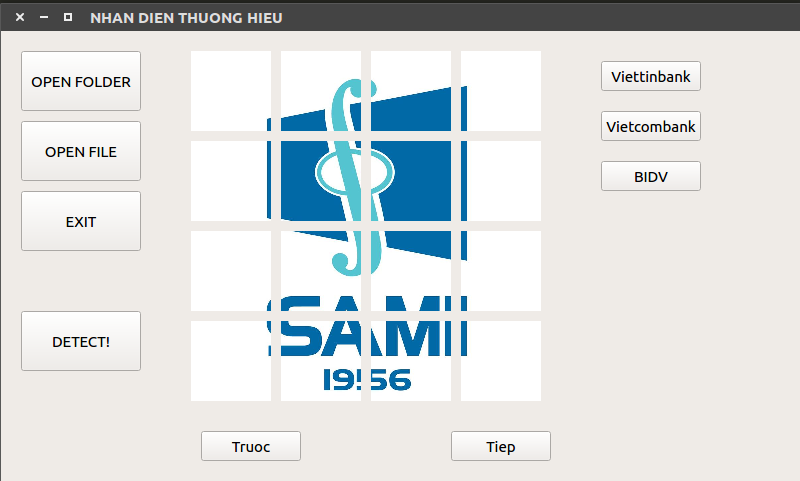

Tensorflow implementation from scratch & optimize for Custom Logo Detection base on Faster-RCNN VGG16 Architecture: 
[Paper](https://arxiv.org/abs/1506.01497), 
<p align="center">

</p>

* Run demo with Logo Detection
  - Download pretrained model <VietinBank, VietcomBank, BIDV> : [GDrive](https://drive.google.com/open?id=1CIExYmXyfvnq2VRkjrqS7hg13F0-QptO)
  - Download some test images [Options]: [GDrive](https://drive.google.com/open?id=1xQDOM7qXln-sp4-rEMReWkFJscHfmKi2) 
  - Install system requirements: 
    ```
    pip3 install -r requirements.txt
    ```
  - Run UI: 
    ```
    pip3 LogoDetectionUI.py
    ```
